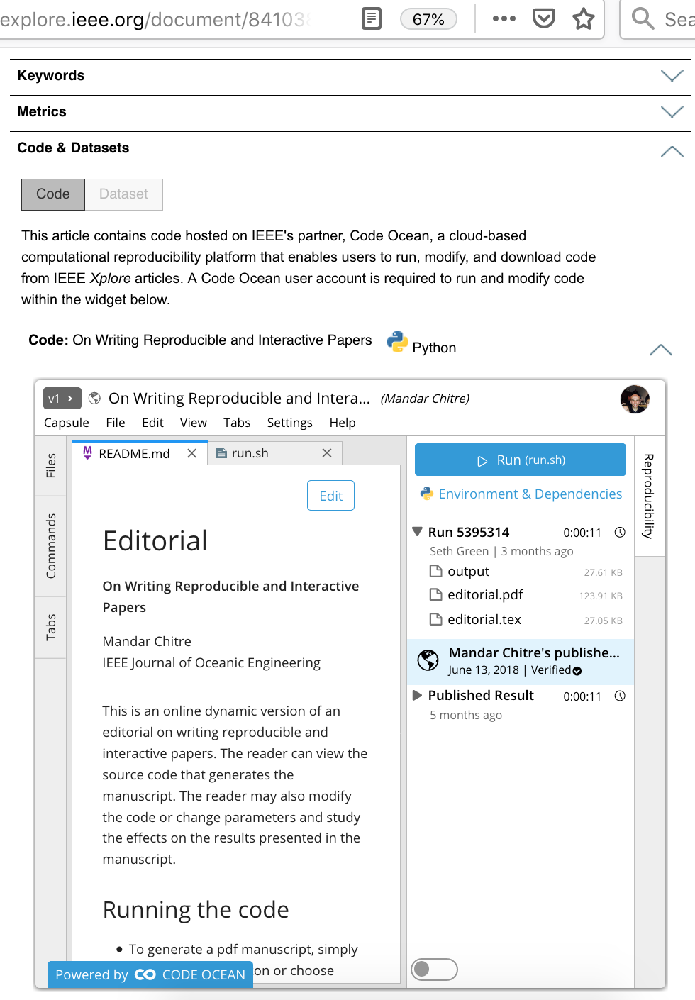

## A really important quote we should all think about
“[A]n article about computational result is advertising, not scholarship. The actual scholarship is the full software environment, code and data, that produced the result.” David Donoho, paraphrasing John Claerbout

## Code Ocean

- Code Ocean is, more or less:
  * JupyterLab IDE + modificationss
  * A robust dependency management system
  * A publishing platform (DOIs & stable URLs)
  * A sharing platform (embed your 'compute capsules' on webpages)
  

## Publishing reproducible R notebooks
* https://codeocean.com/capsule/5777882/tree/v1 for .`Rmd`
* https://codeocean.com/capsule/0129473/tree for `*.R`.

## Publishing reproducible Jupyter Notebooks 
* Notebook + environment + `nbconvert` = a rendered HTML
* https://codeocean.com/capsule/6314882/tree/v1

## Interactive sessions 
- https://codeocean.com/capsule/8962292/tree/v2

- [Jupyter](https://help.codeocean.com/interactive-sessions/interactive-jupyter-sessions)

- [JupyterLab](https://help.codeocean.com/interactive-sessions/interactive-jupyter-sessions)

- Time for a live demonstration

## Questions?
- How is this different than Binder?
- What is the uploading process like?
- How are dependencies managed?
- Is this exportable?
- Whom is Code Ocean for? (All scientists)
- What are the most pressing issues in computational reproducibility? (e.g., big data, confidential data, inferring system level dependencies from listed scientific libraries, adjudicating between many competing worthy aims, what language should we all be using....)
## Reference Slide 1: Publishing on Code Ocean:
- https://codeocean.com/2018/10/16/the-contact-hypothesis-re-evaluated-colon-code-and-data/code
- Will have a DOI and link to your article's metadata

## Reference Slide 2: Embedding on webpages & within articles
- You can also embed your published capsule in your article's HTML page or on your personal webpage, a la https://ieeexplore.ieee.org/document/8410389/algorithms#algorithms:

