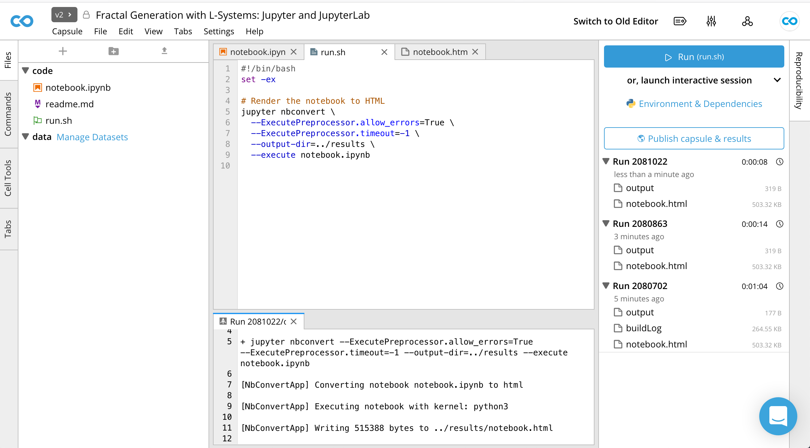
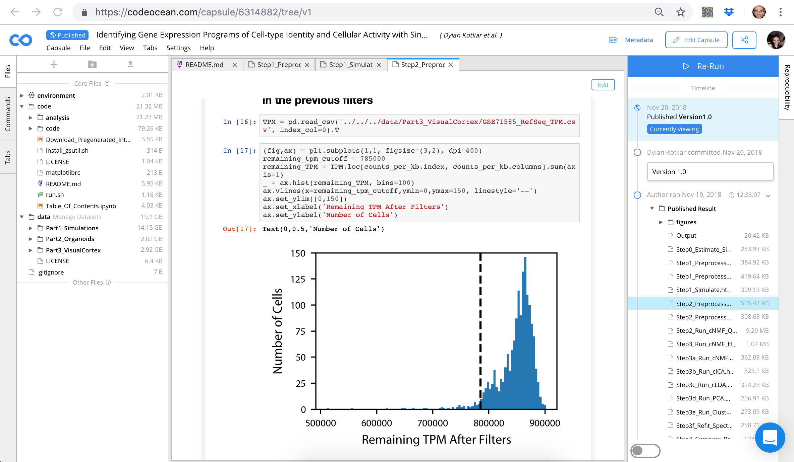
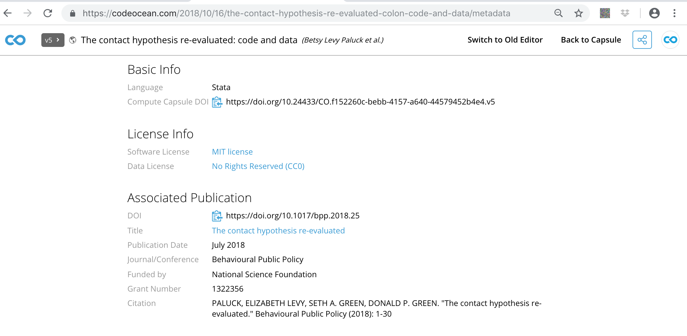
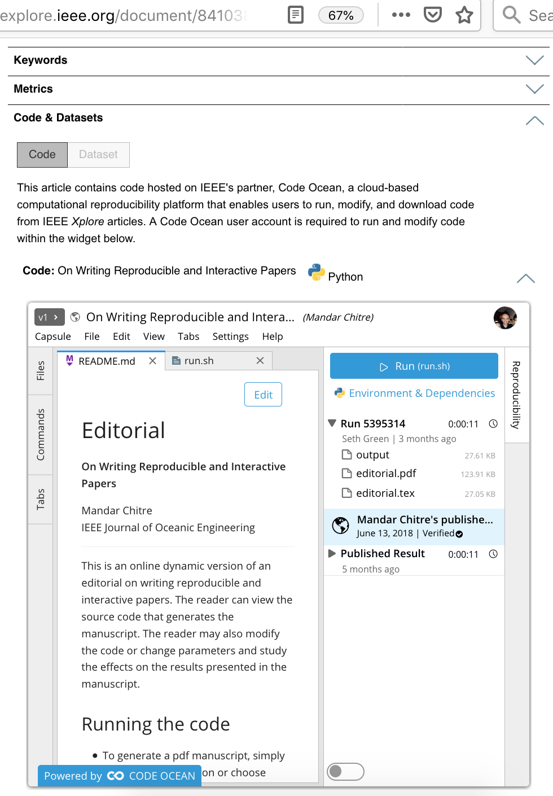

## Code Ocean

- Code Ocean is, more or less:
  * JupyterLab IDE + modificationss
  * A robust dependency management system
  * A publishing platform (DOIs & stable URLs)
  * A sharing platform (embed your 'compute capsules' on webpages)
  
{ width=300px }

## Publishing reproducible Jupyter Notebooks 
Notebook + environment + `nbconvert` = a rendered HTML

{ width=300px }

## Interactive sessions 
https://codeocean.com/2018/11/13/fractal-generation-with-l-systems-colon-jupyter-and-jupyterlab/code

- [Jupyter](https://help.codeocean.com/interactive-sessions/interactive-jupyter-sessions)

- [JupyterLab](https://help.codeocean.com/interactive-sessions/interactive-jupyter-sessions)

- Time for a live demonstration

## Questions?
- How is this different than Binder?
- What is the uploading process like?
- How are dependencies managed?
- Is this exportable?

## Reference Slide 1: Publishing on Code Ocean:
- https://codeocean.com/2018/10/16/the-contact-hypothesis-re-evaluated-colon-code-and-data/code
- Will have a DOI and link to your article's metadata

{ width=300px }

## Reference Slide 2: Embedding on webpages & within articles
- You can also embed your published capsule in your article's HTML page or on your personal webpage, a la https://ieeexplore.ieee.org/document/8410389/algorithms#algorithms:
{ width=300px }
